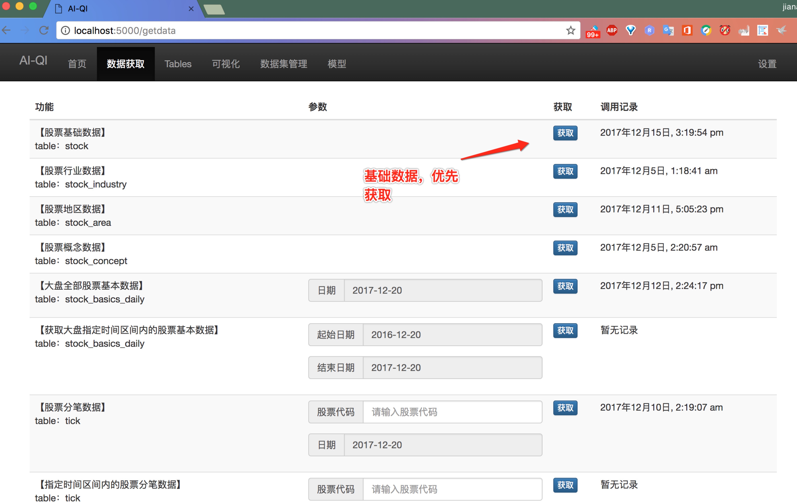
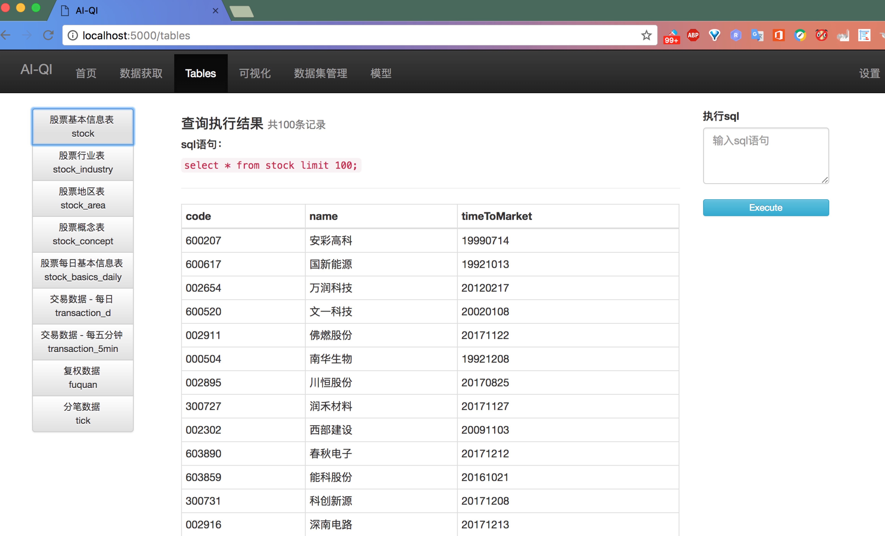
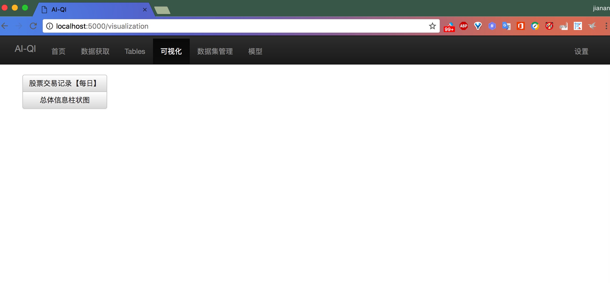
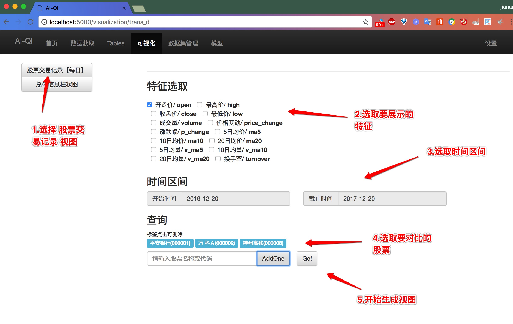
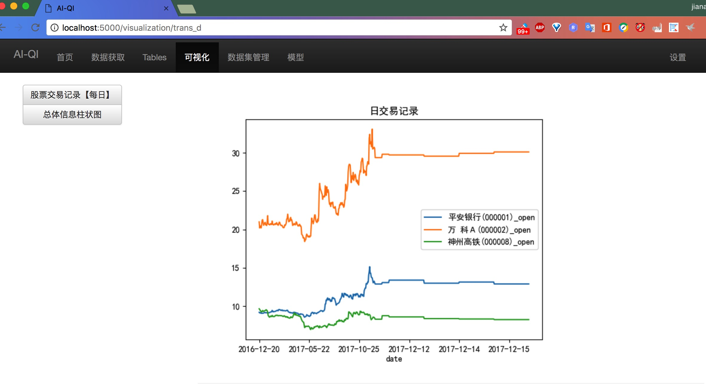
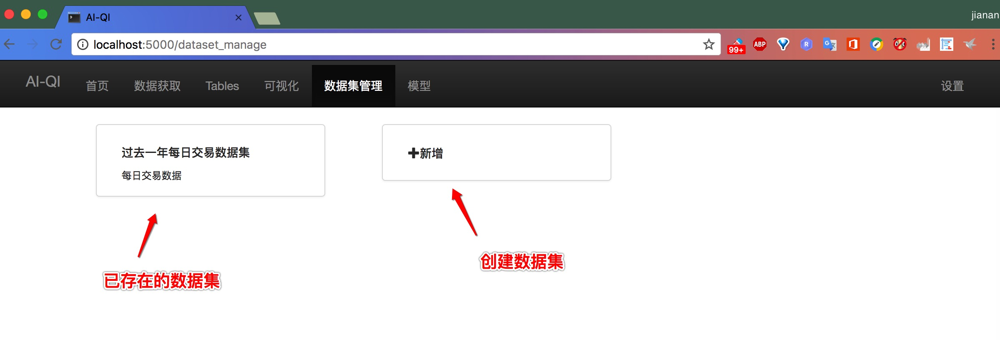
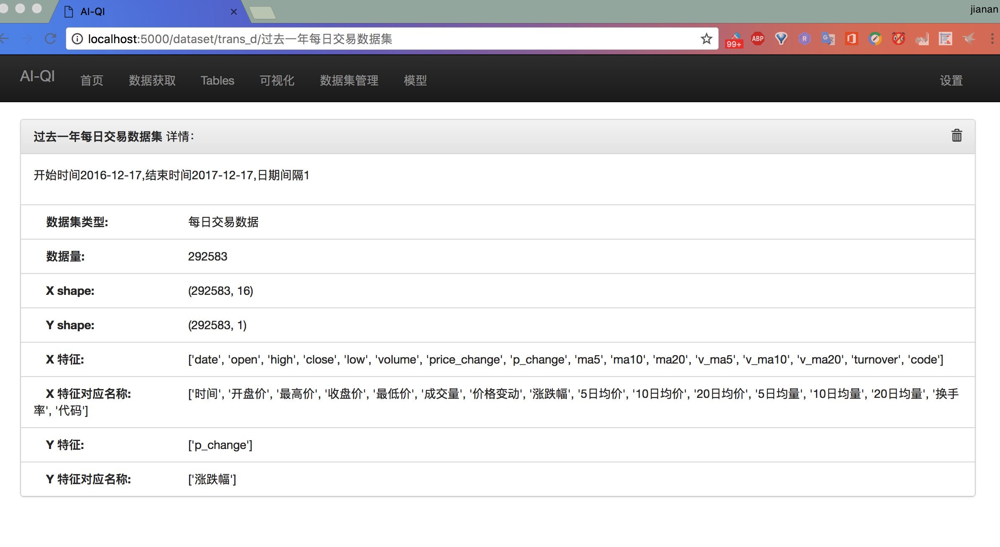
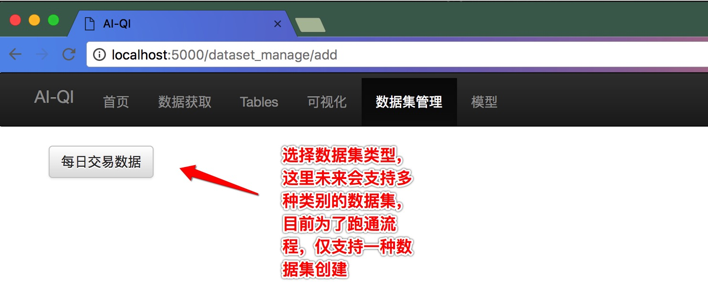
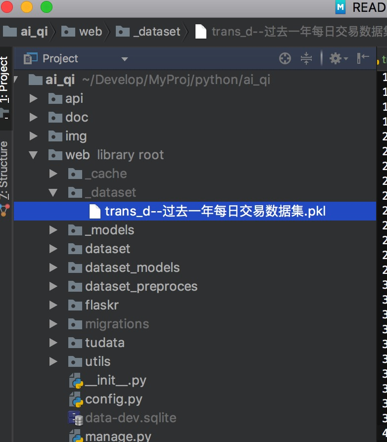

## AI-QI 智能量化投资平台

支持 **数据获取 → 数据存储 → 数据可视化 → 数据集创建 → 数据预处理 → 模型训练 → 实现金融数据的预测** 整条流水线上的工作。


运行环境 Python3

使用前先执行:

```
pip3 install -r requirements.txt
```

-----

### 1.初始化数据库

进入web目录，执行:

```
python3 manage.py db init
```

创建db文件:

```
python3 manage.py db migrate
python3 manage.py db upgrade
```

### 2.开启服务

```
python3 manage.py runserver
```

打开浏览器 [http://127.0.0.1:5000/](http://127.0.0.1:5000/)


-----

## 使用介绍

### 获取数据

在数据获取页面，首先需要获取**股票基础数据**



其余的数据，可以视情况，选择获取

### 查看数据

获取成功后的数据，会在**Tables**界面下，对应的表中展示。



在右侧也可以通过sql语句来查询数据，结果同样会展示在页面中：


其实，查询的数据，返回的结果是一个pandas的DataFrame对象，如果有定制化的需求，可以查看源码，找到这个方法，对返回结果进行灵活处理。

### 数据可视化

可视化目前仅支持两个视图，查看之前需要先获取对应数据，才可以展示。

由于可视化的优先级目前不是最高，为了先把流程走通，仅展示两个可视化结果，后续会逐渐填充。



演示一个具体的例子：

#### 对比展示某三只股票的近一年开盘价走势



展示结果如下：



### 数据集管理

数据集管理页面，这里会展示已存在的数据集，和新建数据集的入口



点击一个已存在的数据集，可以查看对应的详情：



点击数据集管理首页的**+新增**，可以创建一个数据集：




创建好的数据集会存在该目录下：



文件为python3的pickle格式。

### 其他功能

对于数据集的预处理，和模型的训练等流程还在完善中，请持续关注，谢谢！

---

求拍砖，求指点，求点赞，求fork