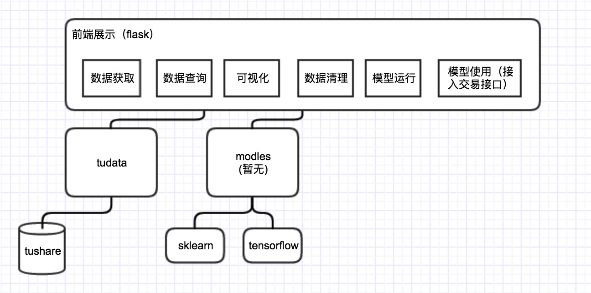
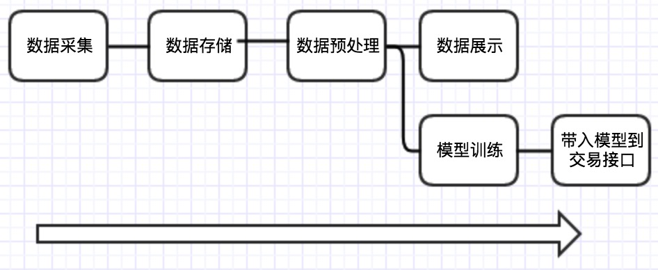
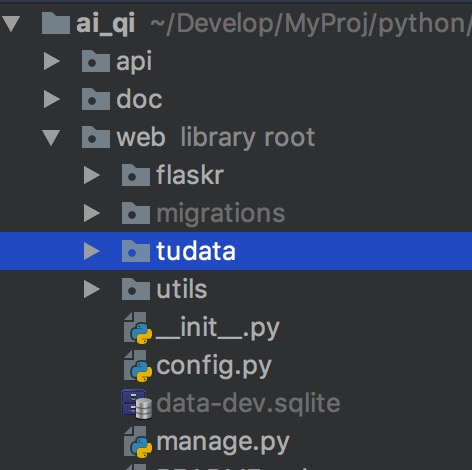
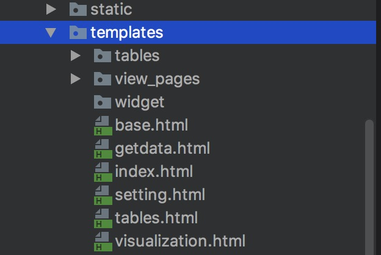
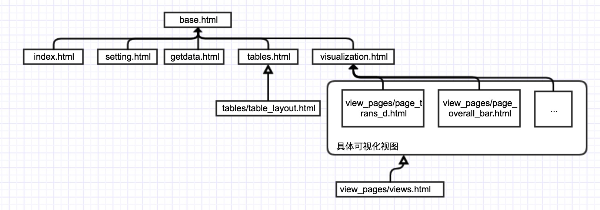

## AI-QI开发文档

项目结构



整个流程流水线化的：



---

### tudata模块

tudata是用来管理tushare相关数据的一个模块，该模块不应该有其他外部的依赖，提供对tushare数据的获取、查询相关操作。（该模块未来会打成单独的包，而不会耦合在web中）

tudata目前的模块位于：



使用方式：

```
import tudata as tu
```

#### 常用对象

##### table对象

table对象很简单，主要记录了表名信息，位于`tudata.db.base.table`。

eg:创建一个table:

```
table(TN_STOCK, "股票基本信息表")
```

通过table对象，我们可以获取到对应的table_name

```
t = tu.table(TN_STOCK, "股票基本信息表")
# 获取table对象的table_name
print(t.name)
```

当然你也可以直接访问常量字符串，直接来获取指定的表名信息

```
# 获取 股票基本信息表 表名
table_name = tu.TN_STOCK
print(table_name)
```

##### 获取目前支持的表

```
tu.TABLE_LIST
```

返回结果是一个list，里面的元素是具体的table对象

#### tudata常用方法


##### 执行sql语句

```
sql = 'select * from stock limit 100'
tu.execute_sql(sql)
```

这里可以执行任意sql语句，如果执行的是查询语句，返回结果是pandas的DataFrame对象。

##### 获取一个表的列名

```
tu.column_names(table_name)
```

返回结果是一个list

##### 获取目前支持的所有股票代码

```
tu.all_codes()
```

返回结果是一个list

##### 根据股票名称查询股票代码

```
code = tu.query_code_by_name(name)
```

##### 根据股票代码获取股票名称

```
name = tu.query_name_by_code(code)
```

##### 查询股票的代码（高级搜索）

```
queryWord = '平安银行(000001)'
code = tu.queryCode(queryWord)
```

这里的`queryWord`如果包含股票名称的话，会优先去查询'('出现之前的股票名称，如果没有查询到，会把数字部分当做股票代码带入查询。比如`queryWord`也可以是`000001`。

##### 查询某表的前n条数据

```
tu.read_top_data(table_name, top=100)
```

返回结果是pandas DataFrame对象。

---

### 界面层逻辑

#### python代码结构
 
代码位于:


- 首页：`index.py`
- 设置：`setting.py`
- 数据获取：`getdata.py`
- tables：`tables.py`
- 可视化：`visualization.py`
	- 具体视图见：`data_views/`目录

#### 模板代码结构

代码位于:



模板继承关系：

